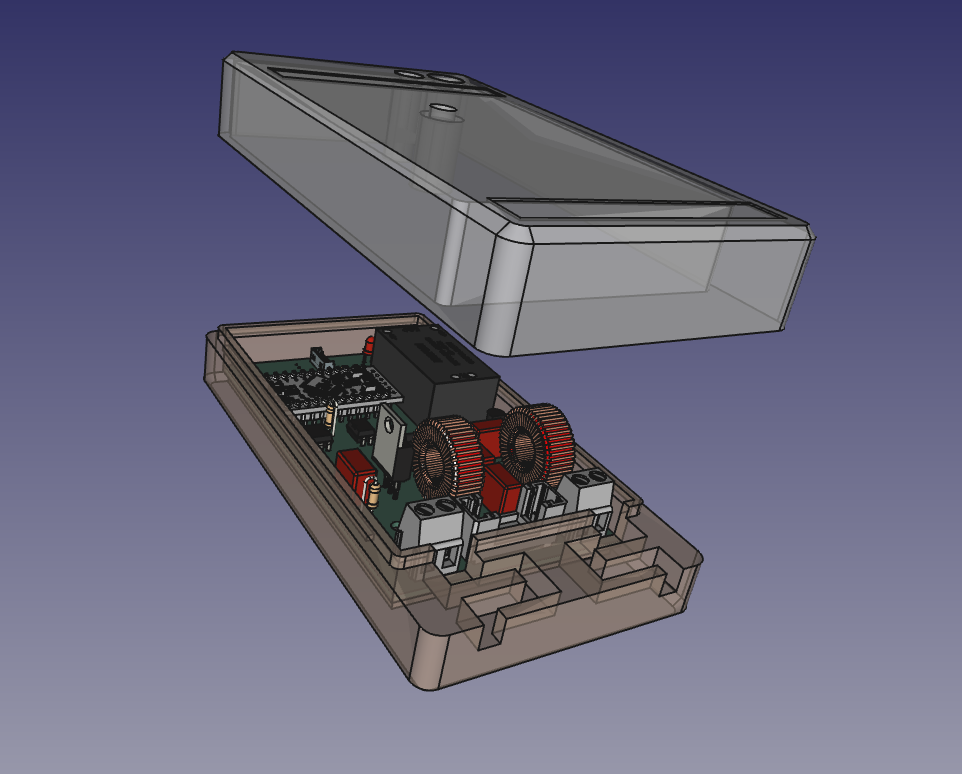

```
---
isProject: true
Desc: Dimmer Phasenanschnitt 1-Kanal
ProjectUrl: https://maschmid.next-cloud.org/index.php/s/7gZ2EqyjfMeqoK9
Author: mankut
AuthorUrl: 
Tags: 230V, Aktor, Dimmer
Thumb: images/thumb.jpg
---
```

# HM-LC-DIM1L-CV

## 230V Dimmeraktor (Phasenanschnitt)


*Hinweis zum Bild: das Netzteil HLK-PM01 im Bild ist in Wahrheit ein HLK-PM03 mit 3.3V Ausgangsspannung. Ich hatte leider kein passendes 3D-Modell gefunden.*

### Funktion

Mit der Technik des Phasenanschnitts lassen sich ohmsche und induktive Wechselstromlasten in der Leistung steuern. Da heutzutage wohl kaum noch jemand ein Interesse daran hat, Glühlampen zu dimmen, wird diese Schaltung eher für Motoren oder Transformatoren eingesetzt werden (Ventilatoren, Abluftmotoren). Über zwei Schraubklemmleisten wird sowohl die Netzspannung als auch der Verbraucher angeschlossen.

### Schaltungsbeschreibung

Siehe [PDF](pcb/HM-LC-DIM1L-CV_Schaltplan.pdf?fileId=26955)

Die benötigte Spannung von 3.3V wird vom PCB-Netzteil PS1 bereitgestellt und dient zur Versorgung des Arduino und des CC1101-Funkmoduls.


Ein diskret aufgebauter Nullspannungsdetektor liefert im Nulldurchgang der Netzspannung einen kurzen Impuls, welcher über den Optokoppler U1 an den Microcontroller gemeldet wird.

Der Leistungsteil besteht aus einem Optokoppler mit TRIAC-Ausgang welcher vom Arduino angesteuert wird, dem Leistungs-TRIAC und ein paar Filterbauteilen um Strom-/Spannungsspitzen zu dämpfen.  
Die Programmierung geschieht entweder wie üblich über den FTDI-Adapter direkt am Arduino oder über die ISP-Schnittstelle, herausgeführt an J1. J1 ist zugegeben nicht ganz die feine Art. Es ist ein in der Arduinowelt eher unüblicher Steckverbinder von Molex (Picoblade), den ich für private Zwecke gerne nutze. Er kann aber auch einfach weggelassen werden. Wer keine OTA-Updates braucht und somit nicht auf die Programmierung per ISP angewiesen ist, wird das nicht vermissen.

### Hinweise

Q1 und Q2, die beiden bipolaren Transistoren im Nulldurchgangsdetektor, können durch andere Standardtransistoren ersetzt werden. Sie müssen keine besonderen Merkmale aufweisen.  
Das Netzteil PS1 ist hoffnungslos überdimensionert, da würde auch eine Variante mit 200mA Ausgangstrom dicke ausreichen. Allerdings gab es diese Dinger nicht in einer kleineren Variante und auf ein Kondensator-"Netzteil" hatte ich keine Lust, da wäre das flashen mangels galvanischer Trennung zum Abenteuer geworden.

Der Haupt-TRIAC D6 kann auch durch andere Typen ersetzt werden. Die Wahl fiel von meiner Seite aus auf den BT138 weil mir dieser in Massen zur Verfügung steht ;-). Wer besonders kleine Leistungen schalten will, mag eventuell einen TRIAC mit kleinerem Haltestrom bevorzugen. Beim BT138 liegt dieser Haltestrom zwischen 4 und 30mA. In der Praxis bedeutet ein zu großer Haltestrom, dass die Last bei niedriger Leistungseinstellung zu flackern beginnt und eine ordentliche Steuerung erst ab höheren Steuergraden (>50%) möglich ist.

Der Heißleiter TH1 ist ebenfalls optional. Er dient zur Überwachung der Gehäuseinnentemperatur. Bei Bedarf kann man die Anschlüsse verlängern und ihn in der Nähe des Kühlkörpers platzieren. Oder ihn ganz weglassen (und im .ino-File auskommentieren).

#### Achtung 230V!

Bitte Vorsicht beim Nachbau. Wird der TRIAC ohne Isolierung am Kühlkörper angebracht, steht dieser unter Spannung, da fasst man leicht mal hin. Beim Anschluss des Verbrauchers darauf achten, dass dieser die Phase eventuell an einem bestimmten Anschluss haben will (z.B. bei einer Lampenfassung, da darf das Gewinde nicht auf die Phase gelegt werden). Rein von der Funktion her ist es egal, wo Phase und wo N angeschlossen wird.

### Bauteilliste

| Pos | Ref | Wert |
|-----|-----|------|
| 1 | C3, C4 | 47nF / 400V , RM 7.5, 10.3x7.5mm |
| 2 | C1, C2 | 100nF / 400V , RM 7.5, 10.3x7.5mm |
| 3 | R1, R2 | 470k, Bauform 0207, 1/4W |
| 4 | R3 | 330R, Bauform 0207, 1/4W |
| 5 | R4 | 150R, Bauform 0207, 1/4W |
| 6 | R5 | 360R, Baeeuform 0207, 1/4W |
| 7 | R6, R7 | 470R, Bauform 0207, 1/4W |
| 8 | R8 | 10k, Bauform 0207, 1/4W |
| 9 | R9 | 10k, Bauform 0207, 1/4W |
| 10 | L1, L2 | 100µH, 6A, Spule, z.B. Würth WUE 7447070 (bei Reichelt) |
| 11 | D1 - D4 | 1N4007 Gleichrichterdiode |
| 12 | D5 | LED, 3mm, Farbe egal |
| 13 | D6 | TRIAC BT138-600, TO220-Gehäuse |
| 14 | U1 | LTV-817 Optokoppler, DIP4 |
| 15 | U2 | MOC3052M Optokoppler mit TRIAC-Ausgang, DIP6 |
| 16 | U3 | CC1101-Funkmodul |
| 17 | X1, X2 | Schraubklemme 2pol., RM 5.08 oder RM5.00 |
| 18 | F1 | Sicherungshalter für Feinsicherungen 5x20mm und Sicherung 4A mittelträge |
| 19 | SW1 | Kurzhubtaster 6x6mm |
| 20 | A1 | Arduino Pro Mini 3.3V, 8MHz |
| 21 | PS1 | HLK-PM03 von HiLink, Netzteil 3.3V |
| 22 | Q1 | BC547, TO92, NPN-Transistor |
| 23 | Q2 | BC557, TO92, PNP-Transistor |
| 24 | TH1 | NTC 10k, Heißleiter, RM 2.5 |
| 25 | HS1 | Kühlkörper SK104 von Fischer |
| 26 | J1 | Molex Picoblade 53047-0610, Steckverbinder für ISP |

### Gehäuse



Das Gehäuse wurde in FreeCAD entworfen, die [Originaldatei](CAD/HM_AsksinPP_Phasenanschnitt_Gehaeuse.FCStd?fileId=26970) und zwei Step-Dateien ([Deckel](CAD/HM_AsksinPP_Phasenanschnitt_Gehaeuse-Oberteil.step?fileId=26968) und [Boden](CAD/HM_AsksinPP_Phasenanschnitt_Gehaeuse-Unterteil.step?fileId=26969)) zum Import in den Slicer (Prusaslicer frisst direkt step-Dateien) sind im CAD-Verzeichnis zu finden. Die lustigen, gezackten Vertiefungen für die Anschlussleitungen dienen als Zugentlastung. Im Deckel sind zwei kleine rechteckige Vertiefungen für Beschriftungsbänder, so man denn will.

Fertig aufgebaut sieht es dann so aus:


Das Bild zeigt noch die Platine in der Revision A (aktuell ist C) mit einigen Fehlern, deshalb gleicht sie nicht 100%ig dem Bestückungsplan. Das CC1101-Modul hat als Antenne eine 83mm lange Litzenleitung bekommen, die sich im Gehäuse in einem kleinen Schlitz an der Seite verlegen lässt.

### Sketch

Als Sketch kommt eine abgeänderte Vorlage aus dem Asksin-Repo zum EInsatz. Die Serial muss natürlich geändert werden, außerdem ...

Ohne die  folgenden Änderungen wird nach dem EInschalten wiederholt (alle 40ms) kurz eingeschaltet, außerdem schaltet er nicht zuverlässig aus (geht manchmal auf Dauer-AN)

im main (\*.ino)-file, Funktion void setup():

```
phaseCut.stop();
```

innerhalb void loop():

```
if(!phaseCut.isrunning()) digitalWrite(DIMMERPIN, false);
```

Ohne die  folgenden Änderungen wird bei einer Dim-Einstellung von "0" auf Dauer-An gestellt:  
PhaseCut.cpp, Zeile 130:

```
if (_timer < 76 ) digitalWrite(OUTPUT_PIN, HIGH);
```

PWM.h, Zeile 25:

```
static const uint8_t zctable[50] PROGMEM = {
 9, 12, 13, 14, 15, 16, 17, 18, 19, 20, 21, 22, 23, 24, 25,26, 27, 28, 29, 30, 31, 32, 33, 34, 35, 36, 37, 38, 39, 40,41, 42, 43, 44, 45, 46, 47, 48, 49, 50, 53, 55, 60, 62, 64, 68, 70, 72, 76
};
```

PWM.h, Zeile 86:

```
#if PHASECUTMODE == 1    
  uint8_t offset = (STEPS - value)*49/STEPS;
```
